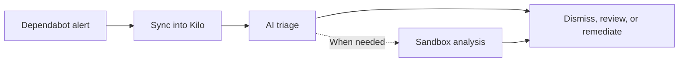

# Security Agent

Security Agent syncs dependency vulnerability alerts from selected GitHub repositories and stores them as Security Findings in Kilo. It uses AI to triage each finding and runs sandbox analysis when project-specific evidence is needed. It also helps you dismiss or remediate findings, send notifications, and review recorded activity.

Use Security Agent to identify reachable Dependabot alerts, prioritize findings, and see which findings the analysis recommends dismissing or remediating with a pull request.

## Prerequisites

Before enabling Security Agent, make sure you have:

1. The [Kilo GitHub App](/docs/automate/integrations#connecting-github) installed with the `vulnerability_alerts` permission.
2. [Dependabot alerts](https://docs.github.com/en/code-security/dependabot/dependabot-alerts) enabled on target repositories.
3. Kilo Code credits for AI model usage.

Security Agent currently works with GitHub Dependabot alerts. If the GitHub App loses required permissions, Security Agent prompts you to re-authorize the app before syncing or analyzing findings.

## Get started

1. Open Security Agent from your personal dashboard or an organization dashboard.
2. If GitHub is not connected, connect it from the Integrations page.
3. Choose a repository scope: all repositories available to the Kilo GitHub App or selected repositories.
4. Turn on Security Agent.
5. Review the General, Automation, Notifications, and SLA settings.

Turning on Security Agent queues an initial sync for the selected repository scope. It then syncs Dependabot alerts every 6 hours. You can also trigger a manual sync from the dashboard or Findings page.

## Organization permissions

Organization members can view the Security Agent dashboard, findings, and analysis evidence. They can also trigger manual syncs, start or retry analysis, start or retry remediation, and request remediation cancellation.

Organization owners and billing managers can change Security Agent settings, turn the agent on or off, dismiss findings, clear orphaned findings, and access organization audit reports. Kilo platform admins can also access these reports for audited support and operations.

Access to organization notifications is more restricted than access to settings: Security Agent emails go only to current organization owners.

## How Security Agent works

Security Agent processes dependency vulnerability alerts through several stages. The main finding flow is:

Notifications and audit recording run alongside this workflow.

1. **Sync** pulls Dependabot alerts from repositories in scope and stores them as Security Findings in Kilo.
2. **Triage** quickly assesses advisory metadata with AI, including package, severity, vulnerable range, patched version, and advisory text.
3. **Sandbox analysis** uses Cloud Agent to inspect the codebase when Security Agent needs project-specific evidence.
4. **Auto-dismiss** can dismiss findings that analysis determines are not exploitable, then sync the dismissal back to GitHub.
5. **Remediation** can ask Cloud Agent to create a pull request for an eligible exploitable finding.
6. **Notifications** can email eligible recipients about new findings and SLA events.
7. **Audit reports** show recorded Security Finding activity for a selected reporting period.

Security Agent treats Dependabot alerts as source data and Kilo Security Findings as the working record. A finding can stay open even after a remediation PR exists. The finding closes only when GitHub reports it fixed or someone dismisses it.

## Use the dashboard

The dashboard shows your current security posture and can be filtered by repository. Use the repository filter to show metrics for one repository or all repositories.

When SLA tracking is enabled, the dashboard shows:

| Metric | Meaning |
|---|---|
| SLA compliance | Percentage of open findings whose deadlines remain within SLA. |
| Deadline passed | Open findings whose persisted SLA deadlines have passed. |
| Due this week | Open findings approaching their deadline, including confirmed exploitable findings. |
| No deadline | Open findings without evidence of an assigned SLA deadline. |

When SLA tracking is disabled, the dashboard focuses on action posture:

| Metric | Meaning |
|---|---|
| Open findings | Current open finding count by severity. |
| Confirmed exploitable | Findings where sandbox analysis confirmed project risk. |
| Needs your review | Findings that need a human decision. |
| Analysis not complete | Findings whose project-specific risk is still unknown. |

The dashboard also highlights one finding to address first. It prioritizes overdue findings, findings needing analysis, exploitable findings, and findings needing human review. Dashboard links open the Findings page with matching filters.

## Browse findings

The Findings page is where you work through the vulnerability backlog.

Use filters and sorting to focus the list:

| Control | Options |
|---|---|
| Repository | All repositories or one repository in Security Agent scope. |
| Severity | Critical, High, Medium, Low. |
| Outcome | Not analyzed, Analysis failed, Exploitable, Not exploitable, Safe to dismiss, Needs review, Triage complete, Fixed, Dismissed. |
| Sort | Severity descending, severity ascending, or SLA due date when SLA tracking is enabled. |

Each row shows severity, title, package, analysis outcome, remediation status, and next action. Common actions include Analyze, Retry, Review, Fix, View PR, Retry fix, Cancel, and View details.

The Findings page shows current analysis capacity and the last sync time. It displays 20 findings per page and refreshes automatically while analysis or remediation is active.

## Inspect a finding

Click a finding to open its detail dialog, which has three tabs.

### Details

The Details tab shows source vulnerability metadata:

- package name and ecosystem;
- CVE and GHSA identifiers;
- vulnerable version range and patched version;
- manifest path;
- severity and status;
- repository and Dependabot source link;
- detection, sync, and SLA timing when available.

If another finding superseded it, the Details tab links to the current canonical finding.

### Analysis

The Analysis tab shows evidence from triage and sandbox analysis.

Triage can classify a finding as Safe to dismiss, Needs analysis, or Needs review. Depending on the evidence, sandbox analysis can classify a finding as Exploitable, Not exploitable, Monitor, Manual review, or Open PR.

The Analysis tab shows current progress, failure state, model details, reasoning, usage locations, the suggested fix, and the next action. You can start analysis, retry a failed analysis, restart an active analysis when supported, or start remediation when the finding is eligible.

### Remediation

The Remediation tab explains whether Security Agent can start a remediation attempt and why. It also shows remediation history, active attempts, PR outcomes, reasons for failure or blocking, validation evidence, risk notes, cancellation state, and the model used.

Available remediation actions depend on server-side safety checks. You may see Start remediation, Retry remediation, Cancel remediation, or View PR.

## Understand statuses and outcomes

A finding's primary status tracks its source lifecycle:

| Status | Meaning |
|---|---|
| Open | Active Security Finding that still needs resolution or dismissal. |
| Fixed | Dependabot reports the alert as fixed. |
| Dismissed | Manual dismissal or auto-dismiss closed the finding and synced the dismissal to GitHub. |
| Superseded | Finding was replaced by a canonical finding after duplicate consolidation. |

The analysis outcome reflects what the AI analysis determined:

| Outcome | Meaning |
|---|---|
| Not analyzed | No analysis has completed. |
| Queued | Analysis is waiting to run. |
| Analyzing | Analysis is running. |
| Analysis failed | Analysis did not complete. |
| Exploitable | Sandbox analysis confirmed reachable project risk. |
| Not exploitable | Sandbox analysis found no reachable vulnerable path. |
| Safe to dismiss | Triage recommends dismissal. |
| Needs review | Human decision required. |
| Triage complete | Triage finished and no sandbox result is present. |

The remediation status tracks Cloud Agent fix attempts:

| Status | Meaning |
|---|---|
| Queued | The remediation attempt has been accepted and is waiting to run. |
| Starting | Cloud Agent launch is being prepared. |
| Running | Cloud Agent is working on the remediation. |
| Cancellation requested | User asked Cloud Agent to stop; cancellation is best effort. |
| PR opened | Security Agent verified a remediation PR for the expected repository and branch. |
| No changes needed | Cloud Agent found no code change to make. Finding remains open. |
| Blocked | Security Agent or Cloud Agent could not proceed safely. |
| Failed | Attempt ended with failure. |
| Cancelled | Attempt stopped without opening a PR. |

## Dismiss findings

You can dismiss a finding manually from its details. Manual dismissal requires a reason:

- Fix started
- No bandwidth
- Tolerable risk
- Inaccurate
- Not used

You can optionally add a comment. A manual dismissal syncs to GitHub and closes the matching Dependabot alert.

When enabled, auto-dismiss automatically dismisses findings that sandbox analysis determines are not exploitable and recommends dismissing. It can also dismiss triage-only findings that recommend dismissal and meet the configured confidence threshold. Security Agent attempts to write each auto-dismissed finding back to GitHub with a `[Kilo Code auto-dismiss]` prefix. See [Configure auto-dismiss](#configure-auto-dismiss) for threshold behavior.

## Remediate findings

Remediation creates a Security Remediation Attempt and asks Cloud Agent to prepare a fix. If Cloud Agent can make a safe change, it opens a pull request in the affected repository.

Starting remediation does not mark the Security Finding fixed. A remediation PR is evidence of work in progress. The finding remains open until Dependabot reports it fixed or someone dismisses it.

### Manual remediation

You can start manual remediation from an eligible finding even when Auto Remediation is disabled. Manual remediation does not have to meet the Auto Remediation severity threshold.

The following safety gates still apply to manual remediation:

- the finding is open;
- Security Agent is enabled;
- the repository is still in Security Agent scope;
- sandbox analysis is complete and fresh for the current finding data;
- analysis provides a concrete fix path;
- no active remediation attempt exists;
- no known remediation PR exists for the finding.

Manual remediation can proceed when exploitability is unknown or the result requires manual review, provided a concrete fix path is available. Monitor-only findings remain ineligible for one-click remediation.

### Auto remediation

Auto Remediation is off by default. When enabled, Security Agent can start remediation automatically only for findings that pass all these gates:

- the finding is open;
- the repository is in Security Agent scope;
- sandbox analysis is complete and fresh;
- the finding is exploitable;
- analysis recommends opening a PR;
- analysis provides a concrete fix path;
- severity meets the configured Auto Remediation threshold;
- there is no active attempt, known PR, or duplicate automatic terminal result.

Auto Remediation applies to future findings after their analysis completes. If Include existing findings is enabled, it also queues eligible findings that have already been analyzed. Duplicate PRs and duplicate automatic attempts for the same analysis result remain suppressed.

### Retry and cancel

You can retry an attempt that failed, was blocked or cancelled, or ended with no changes needed, provided the finding still passes the safety gates and no PR has opened.

You can cancel a queued or running attempt. Cancellation is best effort. If Cloud Agent opens a verified PR before cancellation completes, Security Agent shows the status as PR opened.

## Configure Security Agent

Settings are split into four tabs: General, Automation, Notifications, and SLA.

### General

General settings include:

| Setting | Default | Notes |
|---|---|---|
| Security Agent enabled | Off until you turn it on | Turning it on queues an initial sync for the selected repository scope. |
| Repository selection | Selected repositories during setup | Choose all accessible repositories or selected repositories. |
| Triage model | Kilo Balanced | Used for initial triage and exploitability recommendations. |
| Analysis model | Kilo Balanced | Used for sandbox analysis and result extraction. |
| Remediation model | Kilo Balanced | Used by Cloud Agent for remediation PR work. |
| Analysis mode | Auto | Auto, Shallow, or Deep. |

#### Turn Security Agent on or off

Turning on Security Agent checks the GitHub App permissions and queues an initial sync for the current repository scope. Scheduled syncs then run every 6 hours.

Turning it off stops scheduled syncs and prevents new automatic analysis, remediation, and notification work. It does not delete existing findings or audit history, and it does not cancel a remediation attempt that is already running. Authorized users can still open existing [audit reports](#audit-reports).

#### Choose repository scope

Repository scope controls which Dependabot alerts Security Agent syncs:

- **All repositories** includes every repository currently available to the Kilo GitHub App.
- **Selected repositories** includes only the repositories you choose.

Changing the scope affects future syncs and remediation eligibility. Removing a repository from scope does not close its existing findings. Open findings remain eligible for SLA tracking until they are fixed, dismissed, superseded, or deleted. If the GitHub App can no longer access a repository, its findings become orphaned and can be removed through [Clear orphaned findings](#clear-orphaned-findings).

#### Choose models

Security Agent uses a separate model for each stage:

- The Triage model reviews advisory metadata and makes the initial exploitability recommendation.
- The Analysis model runs sandbox analysis and extracts the result.
- The Remediation model is used by Cloud Agent to prepare remediation pull requests.

Kilo Balanced is the default for all three stages. You can change each model independently. The model recorded in finding details is the model used when that analysis or remediation attempt ran. AI triage, sandbox analysis, and remediation consume Kilo Code credits.

#### Choose an analysis mode

Analysis mode controls how Security Agent analyzes a finding after syncing it.

| Mode | What happens |
|---|---|
| Auto | Run triage first, then sandbox analysis only when triage recommends it. |
| Shallow | Run triage only. Sandbox analysis does not run automatically. |
| Deep | Run sandbox analysis for every finding. |

Auto is the default. It runs sandbox analysis only when triage determines that codebase-level analysis is needed, which limits sandbox-analysis credit usage.

### Automation

Automation settings include:

| Setting | Default | Notes |
|---|---|---|
| Auto-analysis | Off | Automatically analyzes synced findings. |
| Auto-analysis minimum severity | High and above | Critical only, High and above, Medium and above, or All severities. |
| Auto-analysis include existing | Off | Queues previously synced eligible findings. |
| Auto-remediation | Off | Automatically starts remediation for eligible exploitable findings; successful attempts open PRs. |
| Auto-remediation minimum severity | High and above | Critical only, High and above, Medium and above, or All severities. |
| Auto-remediation include existing | Off | Queues already-analyzed eligible findings; duplicate PRs stay suppressed. |
| Auto-dismiss | Off | Automatically dismisses findings that analysis determines are not exploitable and recommends dismissing. |
| Auto-dismiss confidence threshold | High confidence only | High confidence only, Medium or higher, or Any confidence. |

#### Configure auto-analysis

Auto-analysis is off by default. When enabled, it queues open findings that are first synced after activation and meet the minimum severity:

- **Critical only** analyzes critical findings.
- **High and above** analyzes high and critical findings.
- **Medium and above** analyzes medium, high, and critical findings.
- **All severities** analyzes every finding, including findings whose severity is unknown.

Without Include existing findings, previously synced findings are not added to the automatic-analysis backlog. Turning on Include existing findings queues eligible open findings that already exist in Kilo. Re-enabling Auto-analysis while Include existing findings remains on also checks that backlog. This can use additional credits.

The selected [analysis mode](#choose-an-analysis-mode) controls the depth of each automatic analysis. Auto-analysis shares per-owner analysis capacity with manual analysis, so a large backlog may take time to finish.

#### Configure auto-remediation

Auto-remediation acts only on eligible findings that meet its minimum severity, using the same cumulative severity bands as Auto-analysis. Include existing findings also applies the policy to eligible findings whose sandbox analysis is already complete. Re-enabling Auto-remediation or lowering its severity threshold while Include existing findings is on checks the existing backlog again. Duplicate PRs and duplicate automatic attempts remain suppressed.

The automatic severity threshold does not restrict manual remediation. See [Auto remediation](#auto-remediation) for the complete eligibility and safety gates, or [Manual remediation](#manual-remediation) for user-triggered fixes.

#### Configure auto-dismiss

Auto-dismiss uses the confidence threshold only for triage-only findings that AI recommends dismissing:

- **High confidence only** accepts only high-confidence recommendations.
- **Medium or higher** accepts medium- and high-confidence recommendations.
- **Any confidence** accepts low-, medium-, and high-confidence recommendations. Use this option with caution.

The confidence threshold does not apply after sandbox analysis. When sandbox analysis determines that a finding is not exploitable and recommends dismissal, Auto-dismiss can dismiss it regardless of confidence. Enabling Auto-dismiss does not start analysis by itself; it applies when an analysis produces an eligible result.

Security Agent records the dismissal in Kilo and attempts to sync it to GitHub with a `[Kilo Code auto-dismiss]` prefix. A GitHub write-back failure does not reopen the local finding. See [Dismiss findings](#dismiss-findings) for manual dismissal behavior.

### Notifications

The Notifications tab controls New-finding Notifications.

| Setting | Default | Notes |
|---|---|---|
| New-finding Notifications | Off | Sends an email when Kilo first inserts an eligible open finding. |
| New-finding minimum severity | High and above | Critical only, High and above, Medium and above, or Low and above. |

#### New-finding notifications

A New-finding Notification is eligible only when Kilo first inserts an open finding whose severity meets the configured minimum. Severity thresholds are cumulative: for example, High and above includes high and critical findings. Later updates, severity changes, and reopening do not make an existing finding new again. Lowering the severity threshold also does not replay earlier findings.

Existing Dependabot alerts discovered during the first Security Agent sync count as new because that sync is the first time Kilo inserts them. Enabling New-finding Notifications later does not replay those historical insertions.

For a personal Security Agent, emails go to the owning user. For an organization Security Agent, they go only to current organization owners. Members and billing managers receive these notifications only if they are also organization owners. See [Notification delivery](#notification-delivery) for delivery checks and deduplication behavior.

### SLA

The SLA tab controls remediation deadlines and SLA notifications.

| Setting | Default | Notes |
|---|---|---|
| SLA tracking | On | Controls SLA dashboard posture and warning or breach eligibility. |
| Critical deadline | 15 days | Editable from 1 to 365 days. |
| High deadline | 30 days | Editable from 1 to 365 days. |
| Medium deadline | 45 days | Editable from 1 to 365 days. |
| Low deadline | 90 days | Editable from 1 to 365 days. |
| SLA notifications | Off | Sends warning and breach emails. |
| SLA notification minimum severity | High and above | Critical only, High and above, Medium and above, or Low and above. |
| SLA warning lead time | 3 days | Whole number from 1 to 365 days. |

#### How SLA deadlines work

Security Agent calculates a finding's deadline from the date GitHub first detected the Dependabot alert and the configured number of days for its severity. When a later sync changes the finding's severity or uses updated deadline settings, Security Agent refreshes the persisted deadline.

Turning off SLA tracking removes SLA posture from the dashboard and makes findings ineligible for SLA Warning and SLA Breach Notifications. It does not close findings, remove their persisted deadlines, or erase recorded activity. Security Agent continues to refresh deadlines when it syncs findings.

#### SLA notifications

SLA notifications require both SLA tracking and SLA notifications to be enabled. The minimum severity is cumulative, and warning lead time controls how many whole days before the persisted deadline a warning becomes eligible. See [Notification delivery](#notification-delivery) for exact timing, deduplication, and setting-change behavior.

## Notification delivery

Security Agent currently sends notifications only by email.

Notification kinds:

| Kind | When eligible |
|---|---|
| New-finding Notification | Kilo first inserts an eligible open finding. |
| SLA Warning Notification | Eligible open finding enters configured warning window before persisted SLA deadline. |
| SLA Breach Notification | Eligible open finding reaches or passes persisted SLA deadline. |

A finding that is already breached does not receive a stale warning. A warning sent earlier does not suppress the later breach notification. If you enable SLA notifications later, an eligible open finding can produce its current warning or breach during the next evaluation.

Security Agent creates at most one notification of each kind per finding and recipient. Syncs and sweeps do not intentionally create duplicate notification events. Sent notifications are not replayed when settings change.

Delivery is asynchronous. Before sending an email, Kilo rechecks the current finding state, Security Agent settings, severity thresholds, SLA state, and recipient authorization. Kilo cancels unsent notification work if the finding is fixed, dismissed, superseded, deleted, or no longer meets the configured threshold, or if the recipient is no longer authorized.

Email subjects are:

| Kind | Subject |
|---|---|
| New finding | Kilo Security Agent: New finding |
| SLA warning | Kilo Security Agent: SLA warning |
| SLA breach | Kilo Security Agent: SLA breached |

Emails include finding severity, repository, title, description, CVE/GHSA/CVSS metadata when available, the SLA deadline for SLA emails, a link to Security Agent findings, and a link to the relevant notification settings.

## Audit reports

The audit report shows Security Finding activity recorded for an owner during a selected reporting period. Open it from Security Agent navigation at the applicable route:

- `/security-agent/audit-report`
- `/organizations/:organizationId/security-agent/audit-report`

The audit report is based on activity recorded by Kilo. It does not prove that every historical event is present, show repository scan coverage, or provide aggregate SLA compliance.

### Report period and filters

By default, the report covers the last 90 calendar days, ending today. A reporting period cannot exceed 90 inclusive calendar days. Kilo rejects future or reversed ranges.

Filters:

| Filter | Options |
|---|---|
| Reporting period | Date range up to 90 inclusive calendar days. |
| Severity | All, Critical, High, Medium, Low. |
| Recorded state | All, Open, Fixed, Dismissed, Superseded, Deleted. |
| Repository | All repositories or one repository recorded in report evidence. |

For each matching finding group, filters retain the complete timeline within the selected period.

### Report content

The report starts with summary counts for findings, events, superseded findings, and severity. It then groups activity by Security Finding, combining relevant repository, package, advisory, status, and SLA context with a timeline for the selected period.

Each timeline event shows when Kilo recorded or applied the activity, who or what performed it, and the evidence needed to understand the outcome. Superseded and deleted findings retain their recorded identity and lifecycle context.

### Reportable activity

The audit report includes material Security Finding activity recorded during the selected period:

- a finding imported into Kilo;
- a severity change;
- a status change, including reopened and fixed;
- manual dismissal, auto-dismissal, supersession, or deletion;
- terminal analysis completion or failure;
- a remediation request;
- remediation ending with PR opened, failed, blocked, cancelled, or no changes needed.

The audit report excludes reads, page views, unchanged sync observations, queue claims, heartbeats, and retries with no new finding-level outcome. It also excludes notification delivery history, repository scan-coverage appendices, configuration timelines, and report-generation events within the report itself.

If a report query fails, times out, or exceeds its budget, Kilo returns no report content rather than partial results. Choose a shorter reporting period and generate the report again.

### Report access

Personal audit reports are available to the owning user.

Organization audit reports are available to organization owners, billing managers, and Kilo platform admins. Under current route permissions, organization members who are not owners or billing managers can use other Security Agent surfaces but cannot access organization audit reports.

Security Agent does not need to be enabled to view an existing report. The report page is available after GitHub integration and the initial Security Agent configuration have been set up. Setup-only states redirect to Settings.

## Clear orphaned findings

If repositories are removed from GitHub integration or become inaccessible, their findings can become orphaned. The Settings page shows a cleanup card when orphaned repositories exist.


Clearing orphaned findings permanently deletes findings for the selected repository. You cannot undo this action. Use it only if the repository will not be reconnected.


## Compare with Code Reviews

Security Agent and Code Reviews cover different security surfaces.

| Feature | What it covers |
|---|---|
| Code Reviews | Pull request diffs, including security patterns in new code. |
| Security Agent | Dependency vulnerability alerts across selected repositories, including reachability analysis and remediation for Dependabot findings. |

Use Code Reviews to catch risky changes before they are merged. Use Security Agent to manage the dependency vulnerability backlog and determine which Dependabot alerts are exploitable in your codebase.

## Limitations

The following capabilities are not yet implemented but are being considered for upcoming releases of the Security Agent.

- GitLab support for Security Agent findings and remediation.
- Security Finding sources beyond Dependabot alerts, such as npm audit and SBOM analysis.
- Notification channels beyond email.
- Historical replay when you enable New-finding Notifications.
- Analysis and remediation without queue delays. This work currently runs through queues and can be delayed by account capacity or worker backlog.
- Automatic finding updates based on the full remediation PR lifecycle. A finding currently closes only when Dependabot reports it fixed or someone dismisses it.
- Planned remediations that combine multiple Security Findings.
- Repository write-permission checks when you configure Security Agent.
- Audit report periods longer than 90 days.
- Complete legacy-history reconstruction and aggregate historical SLA compliance percentages.
- Server-stored report artifacts, PDFs, report caching, and exhaustive notification delivery history.
